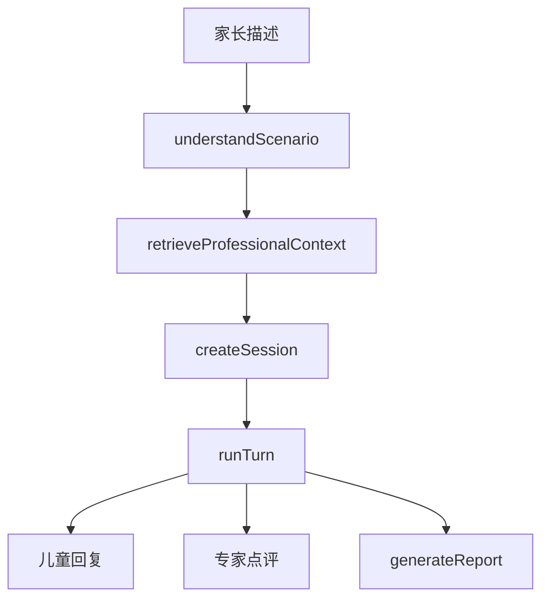

# 多专家 Agent 矩阵

`lib/agents.ts` 是产品行为的编排中心。所有角色复用私有 `profileText()`，把儿童档案作为一致上下文；Prompt 注释采用 COSTAR（Context、Objective、Style、Tone、Audience、Response）组织。模型调用统一经[LLM 客户端](../llm/llm-client.md)，检索上下文来自[知识检索](../knowledge/retrieval.md)。

| 角色 | 符号 | 所属流程 |
|---|---|---|
| 场景理解者 | `understandScenario` | 描述→`Scenario` |
| 心理学检索者 | `retrieveProfessionalContext` | 场景→refs/digest |
| 儿童模拟者 | `childSystemPrompt`、`runTurn` | 演练开场和回复 |
| 观察专家 | `expertSystemPrompt`、`runTurn` | 逐句教练点评 |
| 协调总结专家 | `generateReport` | 演练报告 |
| 循证课程讲师 | `tutorChat` | 互动课 |
| 周报主编 | `generateWeekly` | 近 7 天总结 |
| 小星玩伴 | `toyChat` | 面向孩子的玩具陪伴 |

图示为演练的顺序依赖；`runTurn` 内儿童与专家调用并行，但场景理解、检索和开场按序发生。

## 共同约束

LLM 只被 Prompt 约束，不会自动进行 schema 校验：现有多数 Agent 用 `chatCompletion(..., {json:true})` 后 `extractJson`，而非 `chatJson`。输出字段需要由调用路由正确落库。危险信号的专家建议与玩具 `alert` 是文本/布尔结果，不会触发通知或人工升级。

要改某一角色，先读其专页： [演练专家](roleplay-agents.md)、[讲师](tutor.md)、[周报主编](weekly-editor.md)、[玩伴](toy-companion.md)。