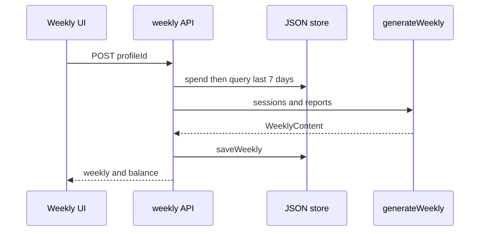

# 周报主编与七天聚合

`generateWeekly(profile, weekSessions, weekReports)` 将已生成报告连接回 session 场景，向模型提供场次、分数、总结、亮点和改进；返回五字段 `WeeklyContent`：headline、growth、parentGrowth、focus、encouragement。Prompt 要求所有判断来自数据，数据少须坦率说明“本周练习较少”，并把下周 focus 限为唯一焦点。

`POST /api/weekly` 使用请求时刻向前七天的 `store.listSessions(profile.id)` 与 `store.listReports(profile.id)`；平均分仅针对窗口中的 reports，保存 `WeeklyReport` 后返回余额。`GET` 按 profileId 返回历史。没有“每儿童每周唯一”约束：重复 POST 会产生多份周报。

图示也是当前风险：扣 3 积分发生在检查本周是否有 session 之前；无数据会返回 400，但不会自动退款。详见[积分](../account/credits.md)。此外 GET/POST 的资源所有权未验证，见[认证边界](../account/auth.md)。