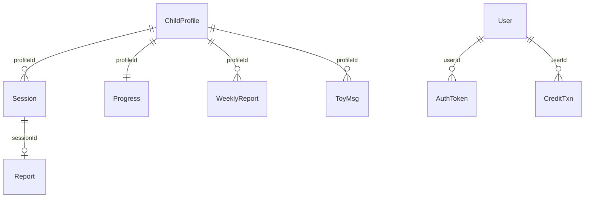

# JSON 持久化与领域模型

`lib/types.ts` 定义演练主模型；`lib/store.ts` 将每个 kind 保存到 `data/store/<kind>.json`，对象以随机 16 位十六进制 ID 为键。目录首次访问时创建；读坏 JSON 会静默按空对象处理，写入为同步全量覆写。因此它适合单实例演示，不是事务数据库。

图中的逻辑关系由 ID 查询实现；尤其 `ChildProfile` **没有** `userId`，不能推断资源归属，安全含义见[认证与 API 安全边界](../account/auth.md)。

## 核心契约

- `ChildProfile`：小名、年龄、性别、诊断、语言、行为、感觉、兴趣、触发点和时间。建档 API 仅强制非空 name 与正 age。
- `Session`：`profileId`、六字段 `Scenario`、检索引用/摘要、`messages`、`active|ended` 状态。消息角色为 parent、child、expert、system；expert 可带 assessment/suggestion/method。
- `Report`：按 `sessionId` 查找，含总分、亮点、至多两项改进、孩子解读、方法和后续练习。报告生成后 session 结束。
- `Progress`：每 profile 一条，`courseId -> lessonId[]`；`completeLesson` 用 `Set` 去重。
- `User`/`AuthToken`/`SmsCode`/`CreditTxn`：用户余额、随机 Bearer token、5 分钟验证码、余额流水。token 无过期字段。
- `Post` 内嵌评论；`WeeklyReport` 按 profile 保存；玩具历史按 profile 保存并在 `appendToy` 裁到最近 40 条。

## 不变量与迁移边界

`seedPosts` 仅补不存在的固定 ID，故幂等；`getSmsCode` 过期返回 null；`addCredits` 若余额会为负则返回 null、不写数据。它仍先写 `users` 再写 `creditTxns`，两文件没有事务或锁，详见[积分](../account/credits.md)。

迁数据库时应先引入 `userId` 到档案及其派生资源、外键/唯一约束、事务账本与幂等键，再替换 store 调用；不要只替换文件读写，否则越权模型与计费一致性仍存在。