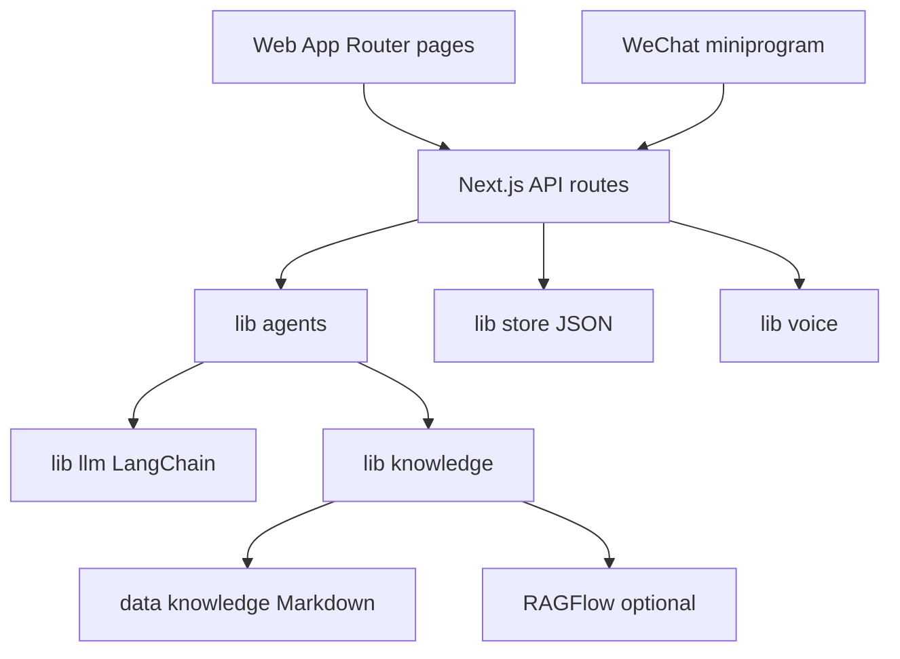

# 全栈架构与运行拓扑

星童猫咪是移动端优先的家庭干预原型：Web 是完整产品面，`miniprogram/` 是复用同一 HTTP API 的原生微信客户端。`app/layout.tsx` 提供 480px 移动壳，`app/page.tsx` 是落地入口；`package.json` 的 `dev`、`build`、`start` 分别运行 Next.js 15。

图示为两类客户端共用服务端的边界；LLM、检索和语音凭据只在服务端读取。

## 分层与责任

- `app/**/page.tsx`：浏览器路由和交互；页面用 `fetch`，认证头由 `lib/client.ts` 从 `localStorage` 的 `xt_token` 生成。
- `app/api/**/route.ts`：业务编排、输入裁剪、部分鉴权和 HTTP 语义。公共变更应先定位所属路由，再跟到 `lib/`。
- `lib/agents.ts`：产品编排层；LangChain 仅是 `lib/llm.ts` 的模型内核，角色 Prompt 与业务状态不委托给框架。
- `lib/store.ts`：零依赖 JSON 持久化。生产 Compose 把 `data/store` 挂为单个 volume；不能安全横向扩容，见[数据模型](data-model.md)。
- `data/knowledge/`：随镜像带入的本地语料；RAGFlow 是可选检索后端，见[检索](../knowledge/retrieval.md)。

`tsconfig.json` 定义 `@/*` 指向仓库根，页面和 API 可稳定使用该别名。设计研究、BP 和部署说明留在 `docs/`，不是运行时代码。

## 主业务链

建档后，`/api/scenario` 创建演练：场景理解→检索→儿童开场；每次消息并行运行儿童模拟与观察专家；两轮家长消息后生成报告。课程、周报、社区、玩具分别由同一 store 和 API 提供，详见[演练生命周期](../practice/session-lifecycle.md)、[课程](../learn/courses.md)、[语音玩具](../voice/toy-endpoint.md)。

## 变更入口与验证

| 意图 | 首选入口 | 窄验证 |
|---|---|---|
| 改 API 行为 | `app/api/<domain>/route.ts` | `npm run build` |
| 改 Agent 行为 | `lib/agents.ts` + 调用路由 | `node scripts/test-llm.ts`（需配置） |
| 改检索 | `lib/knowledge.ts` + `data/knowledge/` | `node scripts/test-knowledge.ts`（需配置） |
| 改持久化 | `lib/store.ts` + 所有资源所有权 | `npm run build`，手动冒烟 |

完整本地验证见[验证](../development/validation.md)。