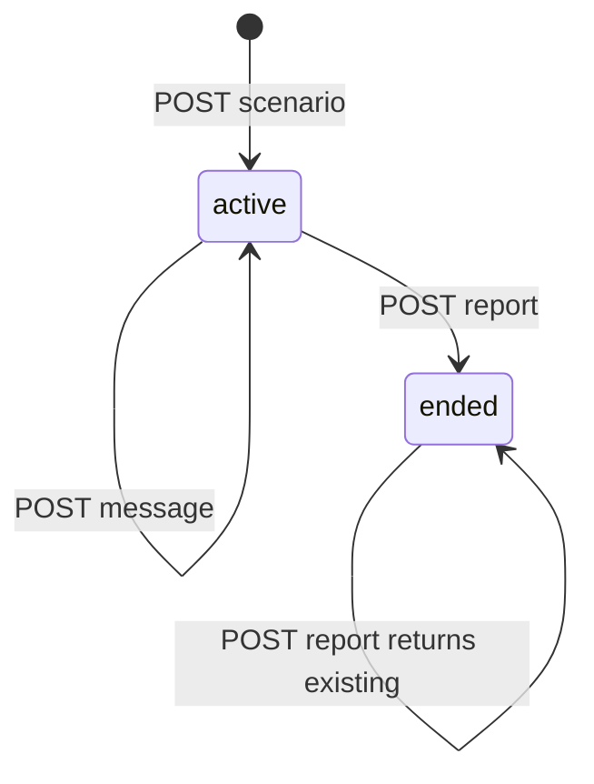

# 孪生演练状态机与 API

图示的状态存于 `Session.status`。`POST /api/scenario` 要求当前 user、已有 profile 和至少 2 字 description；先扣 scenario 5，再 `createSession`。`GET /api/session/[id]` 返回 session 和 profile。`POST message` 仅接受 active session 和非空文本，保存 parent 后运行 `runTurn`，再保存 child/expert 三条消息。`POST report` 要求至少两条 parent，已有报告直接返回；否则生成、保存 Report、将 session ended。GET report 返回报告和 session。

创建、回合、报告的 Agent 契约见[演练专家](../agents/roleplay-agents.md)，界面见[演练 UI](session-ui.md)。当前除了创建场景外，session 端点只按 ID 操作，未检查 token/归属；不得将前端页面守卫误认为授权，见[认证边界](../account/auth.md)。

扣费先于创建；LLM 或保存失败没有自动退款，重复 create 也无幂等键。报告对已有报告幂等但 message 不是。账务恢复改动见[积分](../account/credits.md)。