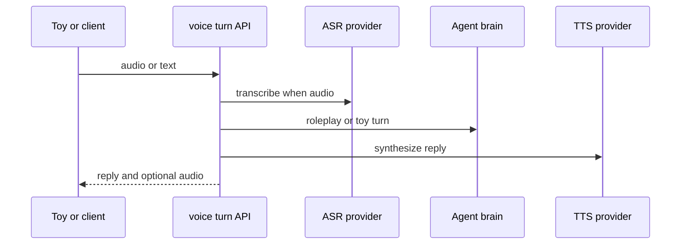

# 听想说一站式玩具端点

`POST /api/voice/turn` 接受 JSON `{text,mode?,sessionId?,profileId?}` 或 multipart audio 和同名字段。音频先 ASR；`mode` 默认 roleplay。输出 `{heard,mode,reply,audio,audioGuide?}`，TTS 成功时 audio 是 `data:<mime>;base64,...`，失败不阻断文本回复而附 guide。

roleplay 模式需 active session，调用 `runTurn` 并保存 parent/child/expert；其 reply 同时含 child 与专家展示内容。toy 模式需 profile，调用 `toyChat`，保存 child/toy 历史。二者均只按 ID 找资源，当前无认证/归属检查，见[认证边界](../account/auth.md)。

硬件协议可消费 toy 的 emotion/action/alert；当前 alert 只是响应字段，不会主动告警，小程序也未接入语音。生产应由已授权的 profile owner 接收 alert：服务端把事件持久化、按监护人通知策略投递、记录确认/失败，并让玩具只执行预先允许的安抚动作，不能把模型文本直接作为紧急处置。调用前先验证 owner，非所有者 403。

除现有 10MB 外，应白名单 MIME、限制时长/速率/并发和每用户配额，拒绝空文件。回归覆盖未配置、空/超大/错误 MIME、ASR/TTS 上游失败、`spokenText` 动作过滤、危险话术 alert、roleplay/toy 非 owner。`docs/VOICE_TOY.md` 讨论 ESP32-S3、xiaozhi-esp32 和级联架构，但仓库没有玩具固件。